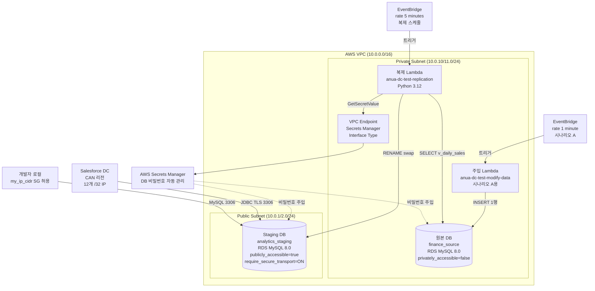
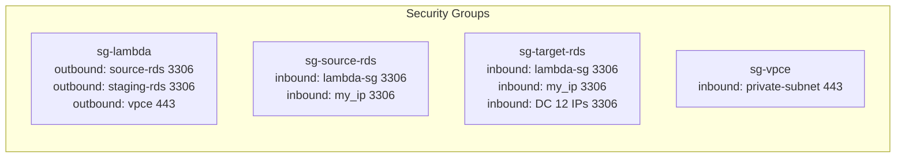
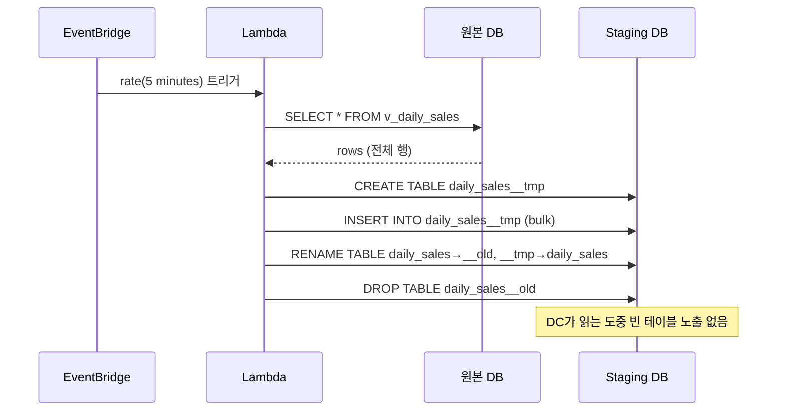

# 아키텍처 다이어그램

## 전체 구성



## 보안 그룹 구성



## 복제 흐름 (Full Replace + RENAME Swap)



## 데이터 흐름

```
[원본 테이블]                [View]               [Staging 테이블]
raw_daily_sales    →    v_daily_sales    →    daily_sales
(민감 컬럼 포함)       (컬럼 선택/마스킹)    (DC가 읽는 복제본)
```
